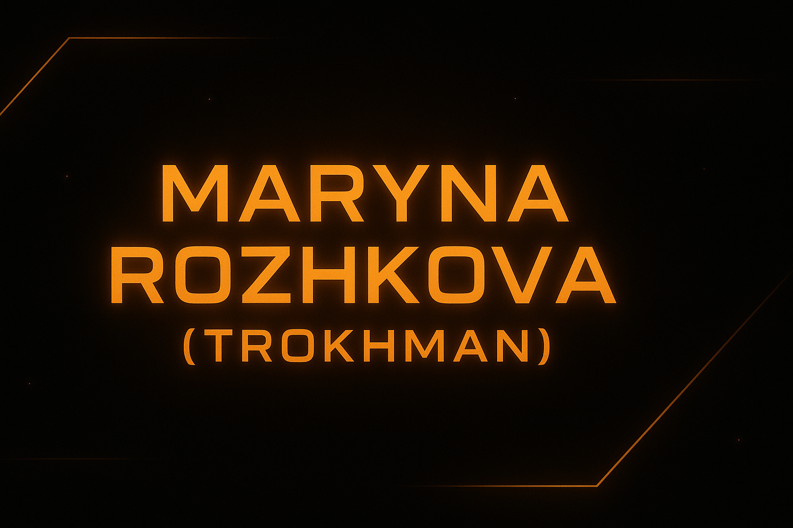

  

# 👋 Hello, I’m Maryna Rozhkova

I'm a passionate and dedicated **web developer** with a strong academic background and a love for impactful, human-centered digital projects. Currently studying at **DCI Digital Career Institute**, I specialize in **frontend development**, a bit of **UI/UX design**, and integrating **AI technologies** into modern web applications.

🌍 Based in Germany  
🎓 Background in Engineering, Computer Science & Intellectual Property  
🎯 Transitioned from academic research and public communication to full-time software development

---

## 🧠 Tech Stack & Skills

- 💻 **Languages & Tools**: HTML, CSS, JavaScript, TypeScript, React, Vite, Node.js, Tailwind, Bootstrap, Git/GitHub
- 🔉 **AI & Innovation**: 
           

- 📦 **Deployment**: Vercel, GitHub Pages, Render
- 📈 **Other**: UI Animation, Neumorphism Design, Accessibility (ARIA), Multilingual Content

---

## 🚀 Highlight Projects

| Project | Description | Stack | Demo |
|--------|-------------|-------|------|
| **SoundPulse** | An online radio SPA built with React — clean UI, minimalistic UX | React, CSS | [GitHub](https://github.com/marrozhkova/SoundPulse) |
| **Neomorphism UI** | Stylish UI kit exploring glassmorphism and neumorphism principles | HTML, CSS | [Live](https://neoromorphism.vercel.app/) |
| **Eurovision-UA** | Informational site about Ukrainian winners of Eurovision | HTML, CSS, React | [GitHub](https://github.com/marrozhkova/eurovision-ua) |
| **Portfolio** | My personal responsive portfolio to showcase design/dev work | React, JS, CSS | [Live](https://marrozhkova-portfolio.vercel.app/) |

> More projects in progress: AI Quiz App, online-shop 🚧

---

## 📚 Education

**Web & Software Development**, DCI Digital Career Institute (2024–2025)  
**Master's in Engineering & Intellectual Property**, NTU KhPI, Ukraine  
**Certified in IP Law**, WIPO, multiple courses (2007–2022)

---

## 📬 Contact & Links

- 🌐 [Portfolio Website](https://marrozhkova-portfolio.vercel.app/)
- 🐙 [GitHub](https://github.com/marrozhkova)
- 📫 **Email**: mar.rozhkova@gmail.com  
- 🌍 Languages: Ukrainian 🇺🇦, German 🇩🇪 (C1), English 🇬🇧 (B2+), Russian 🇷🇺

---

&nbsp;

> _“I believe design is a language — and I refine it with every project.”_

